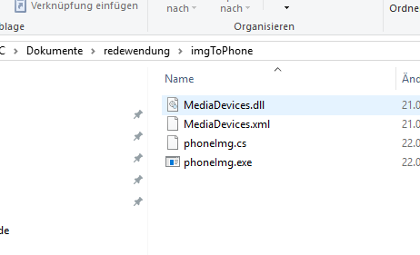

# MTP-pull-files-from-phone
code of the original author: https://github.com/Bassman2/MediaDevices
In order ti save files form the phone in given directory on pc.

MediaDevice Dll file taken from the nuget package mediadevices.1.8.0.nupkg
by changing the .nupkg to .zip and  saving the .xml and .dll locally into the same directory as 
the main phoneImg.cs script.

